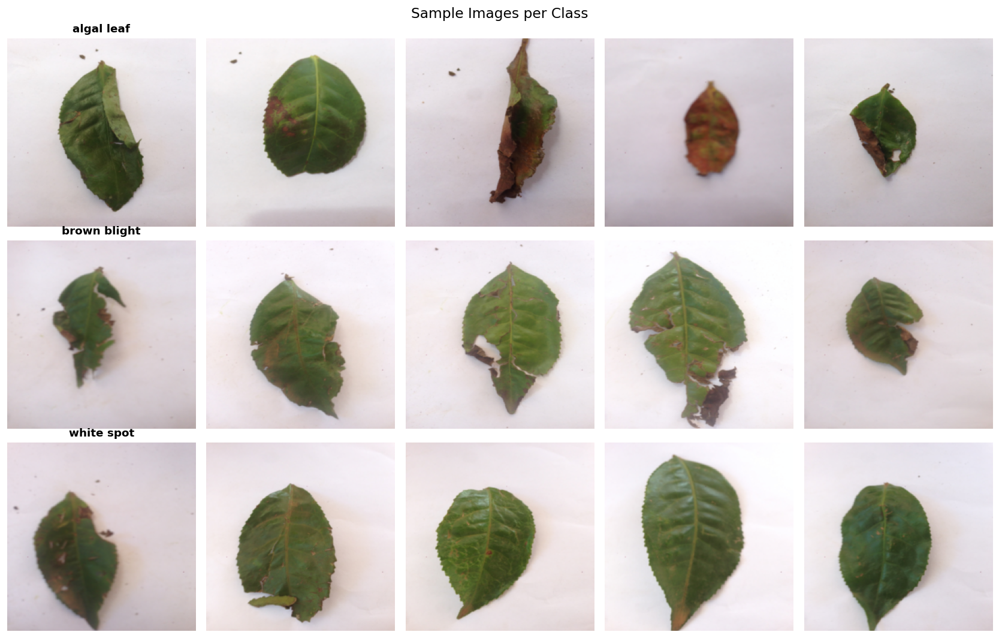
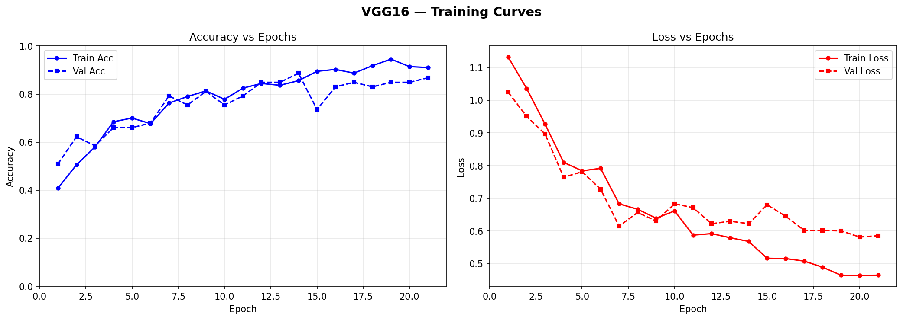
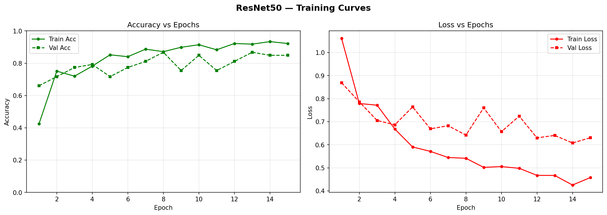
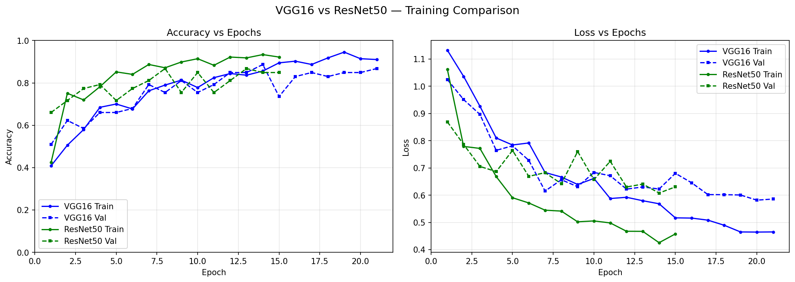
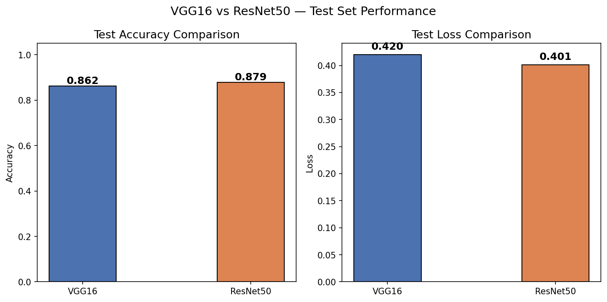
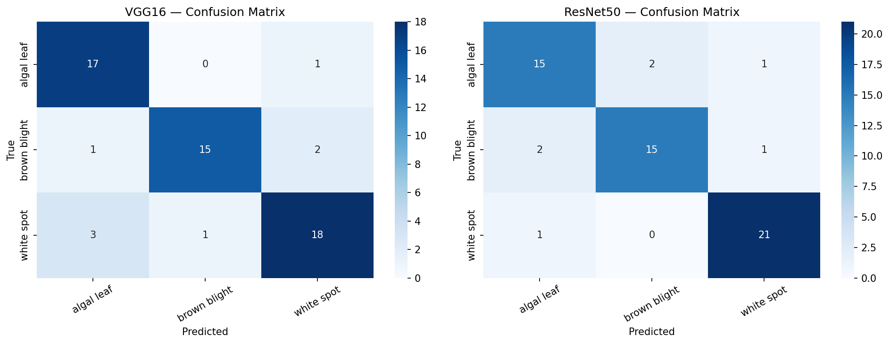

# Tea Leaf Disease Classification Using Transfer Learning

**CSC4093 / DSC4213 — Deep Learning (2024/25)**
**Programming Assignment 02 — Convolutional Networks and Transfer Learning**

---

## Abstract

This report presents a deep learning approach to automated classification of tea leaf diseases using transfer learning. Two pretrained convolutional neural network architectures, **VGG16** and **ResNet50**, were fine-tuned on a dataset of three tea leaf conditions — *Algal Leaf*, *Brown Blight*, and *White Spot*. Both models were trained with data augmentation, dropout regularization, a cosine-annealing learning rate schedule, and early stopping. On the held-out test set, ResNet50 achieved **87.9% accuracy**, slightly outperforming VGG16's **86.2% accuracy**. The full training pipeline, evaluation metrics, and visualizations are documented below.

---

## 1. Introduction

Tea is a major agricultural crop, and early detection of leaf diseases is essential for minimizing crop loss and ensuring quality yields. Manual inspection is time-consuming and prone to human error. This project leverages **transfer learning** — adapting CNNs pretrained on ImageNet — to automatically classify images of tea leaves into one of three disease categories.

The objectives of this project are to:
1. Build an image classification pipeline for tea leaf disease detection.
2. Apply transfer learning using two well-established CNN architectures (VGG16 and ResNet50).
3. Compare the performance of both models using standard classification metrics.

---

## 2. Dataset

| Class | Description |
|---|---|
| **Algal Leaf** | Caused by *Cephaleuros parasiticus* |
| **Brown Blight** | Caused by *Colletotrichum camelliae* |
| **White Spot** | Caused by *Pestalotiopsis theae* |

- ~100 images per class (3 classes total)
- Split: **70% Train / 15% Validation / 15% Test**
- Images resized to 224×224 to match the input requirements of VGG16 and ResNet50

### Sample Images

*Figure 1: Representative samples from each of the three disease classes.*

### Data Augmentation

To reduce overfitting given the small dataset size, the training set was augmented with:
- Random resized crop (scale 0.7–1.0)
- Random horizontal and vertical flips
- Random rotation (±20°)
- Colour jitter (brightness, contrast, saturation, hue)
- Random grayscale conversion (5% probability)

Validation and test images were only resized and normalized using ImageNet statistics.

---

## 3. Methodology

### 3.1 Model Architectures

**VGG16**
- Pretrained on ImageNet
- Convolutional feature layers frozen, except the **last convolutional block (block 5)**, which was unfrozen for fine-tuning
- Classifier head replaced with an additional Dropout (p=0.5) followed by a 3-class Linear layer

**ResNet50**
- Pretrained on ImageNet
- All residual blocks frozen, except **layer4 (the last residual block)**, which was unfrozen for fine-tuning
- Final fully-connected layer replaced with Dropout (p=0.5) + 3-class Linear layer

### 3.2 Training Setup

| Hyperparameter | Value |
|---|---|
| Optimizer | Adam (weight decay = 1e-4) |
| Learning rate | 1e-4 |
| LR schedule | Cosine annealing (T_max = 25, eta_min = 1e-6) |
| Loss function | Cross-entropy with label smoothing (0.1) |
| Batch size | 16 |
| Max epochs | 25 |
| Early stopping patience | 7 epochs (based on validation accuracy) |
| Random seed | 42 |

Both models were trained on the same train/validation/test splits, with the best-performing weights (highest validation accuracy) restored at the end of training.

---

## 4. Results

### 4.1 Training Curves

**VGG16** trained for 21 epochs before early stopping. Training and validation accuracy steadily increased to ~0.92 / ~0.87, while losses decreased correspondingly, with some validation noise mid-training.

*Figure 2: VGG16 training/validation accuracy and loss over 21 epochs.*

**ResNet50** converged faster, reaching its best validation accuracy by epoch 15 before early stopping was triggered. Validation loss showed more fluctuation but trended downward overall.

*Figure 3: ResNet50 training/validation accuracy and loss over 15 epochs.*

The combined comparison below overlays both models' learning curves on the same axes:

*Figure 4: VGG16 vs ResNet50 — accuracy and loss comparison.*

### 4.2 Test Set Performance

| Model    | Test Accuracy | Test Loss | Precision | Recall | F1-Score |
|----------|:------------:|:---------:|:---------:|:------:|:--------:|
| VGG16    | 86.21%       | 0.420     | 0.8673    | 0.8621 | 0.8620   |
| ResNet50 | **87.93%**   | **0.401** | 0.8788    | 0.8793 | 0.8787   |

*(weighted-average precision, recall, and F1-score across the three classes)*

*Figure 5: Test accuracy and loss comparison between VGG16 and ResNet50.*

### 4.3 Confusion Matrices

*Figure 6: Confusion matrices for VGG16 (left) and ResNet50 (right) on the test set.*

- **VGG16** misclassified mainly between *brown blight* and *white spot* (3 white spot samples predicted as brown blight, 2 brown blight as white spot).
- **ResNet50** showed a similar but slightly smaller error pattern, with most confusion occurring between *algal leaf* and *brown blight*. Notably, ResNet50 achieved perfect classification of *brown blight* with no missed *white spot* predictions for that class.

---

## 5. Discussion

Both models achieved strong performance (>85% test accuracy) despite the small dataset size, demonstrating the effectiveness of transfer learning for this task. Key observations:

- **ResNet50 outperformed VGG16** by ~1.7 percentage points in test accuracy and achieved a lower test loss, likely due to its residual connections enabling more effective fine-tuning of deeper features with fewer trainable parameters relative to its depth.
- **Early stopping** was essential — ResNet50 reached its best validation performance much earlier (epoch 15) than VGG16 (epoch 21), suggesting it converges faster on this dataset.
- The main source of error for both models was confusion between **brown blight** and **white spot**, which is plausible given that both diseases can produce similar brown/necrotic spotting patterns on the leaf surface.
- Data augmentation and dropout were important given the limited dataset (~100 images per class), helping to reduce overfitting as evidenced by the relatively close train/validation curves.

---

## 6. Conclusion

This project successfully applied transfer learning with VGG16 and ResNet50 to classify tea leaf diseases into three categories, achieving test accuracies of 86.2% and 87.9% respectively. ResNet50 was the better-performing model overall, offering both higher accuracy and lower loss. Future improvements could include collecting more training data, experimenting with additional architectures (e.g., EfficientNet), and applying more targeted augmentation strategies to address the brown blight / white spot confusion.

---

## Appendix: Reproducing the Results

1. Install dependencies: `pip install -r requirements.txt`
2. Place `Data_A2.zip` in the project root
3. Run `tea_leaf_disease_classification.ipynb` top to bottom

All figures and the comparison table (`results/model_comparison.csv`) are regenerated automatically into the `results/` folder.
